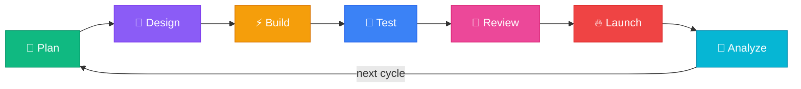
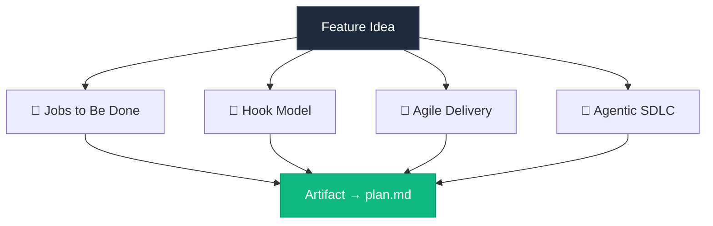

# ⚡ Vibeslop

> *"Ship products, not features."*

Product delivery skills for [Claude Code](https://docs.anthropic.com/en/docs/claude-code) that apply **four proven methodologies** across every phase of development. One install. Seven slash commands. Continuous improvement. 🔄

### 🌐 [See the interactive methodology → or13.io/vibeslop](https://or13.io/vibeslop)

## 🔄 The Cycle



| Command | Phase | *The Vibe* |
|---------|-------|-----------|
| `/vibeslop.plan` | 🎯 Plan | *"Choose what's worth building next"* |
| `/vibeslop.design` | 💎 Design | *"Sketch the solution at the right altitude"* |
| `/vibeslop.build` | ⚡ Build | *"Let the team solve the problem their way"* |
| `/vibeslop.test` | 🔮 Test | *"Catch the gap between built and needed"* |
| `/vibeslop.review` | 🧬 Review | *"Face whether the work moved the needle"* |
| `/vibeslop.launch` | 🔥 Launch | *"Get the work into customers' hands"* |
| `/vibeslop.analyze` | 🌊 Analyze | *"Name what's not working"* |

## 🚀 Install

```bash
curl -fsSL https://raw.githubusercontent.com/or13/vibeslop/main/install.sh | bash
```

> 📦 **One-liner** · 🚫 **No dependencies** · 🔌 **Speckit optional**

Update to the latest:

```bash
curl -fsSL https://raw.githubusercontent.com/or13/vibeslop/main/install.sh | bash -s -- --force
```

## 🔍 Four Lenses

Every phase applies the same four methodology lenses — the agent does the work, then presents condensed findings for your review.



🎯 **[Jobs to Be Done](https://or13.io/vibeslop#jtbd)** — Frame work around customer struggling moments, not feature lists. Score outcomes by importance × satisfaction gap.

🔁 **[Hook Model](https://or13.io/vibeslop#hook-model)** — Design habit loops: trigger → action → variable reward → investment. If there's no natural hook, the skill says so.

📐 **[Agile Delivery](https://or13.io/vibeslop#agile)** — Fixed time, variable scope. Every bet has an appetite and explicit cuts. No unbounded backlogs.

🤖 **[Agentic SDLC](https://or13.io/vibeslop#agentic)** — When no human fills a team role, agents fill it — faster. Define tool categories and human vs. agent responsibilities.

## ✨ How It Feels

You type a command. The agent researches your codebase, drafts all four lenses, and presents **condensed findings** — not a wall of text:

```
🎯 Plan complete for: Add user onboarding flow

⚡ Agents filling reviewer + tester roles — no human bottleneck
💎 Opportunity gap of 8 — users desperately want this but nothing exists
⚠️ Auth integration is a security-sensitive path — needs threat modeling
🔮 2-day appetite is tight if we include email verification

Say "ok" to proceed or ask about any item.
```

The full artifact is written to `plan.md` only after you approve. Each phase builds on the last. 🌐 **[See the interactive methodology →](https://or13.io/vibeslop)**

## 🚀 Self-Deploying

**Launch** doesn't just write an artifact — it commits and pushes your code (with your approval). **Analyze** verifies the published state matches local. The skills practice what they preach.

## 🔌 Speckit Integration

Works standalone or with [speckit](https://github.com/or13/speckit) for feature directory management:

- **With speckit**: Artifacts go to `plan.md` in the active feature directory
- **Without speckit**: Artifacts go to `plan.md` in the current directory

## 📋 Requirements

- [Claude Code](https://docs.anthropic.com/en/docs/claude-code) CLI
- `curl` (for installation)

## 🤝 Contributing

PRs welcome. See [CONTRIBUTING.md](CONTRIBUTING.md).

## 📄 License

Apache 2.0 — see [LICENSE](LICENSE).

---

<p align="center">
  🌐 <a href="https://or13.io/vibeslop"><strong>or13.io/vibeslop</strong></a> · Built with vibeslop ⚡
</p>
