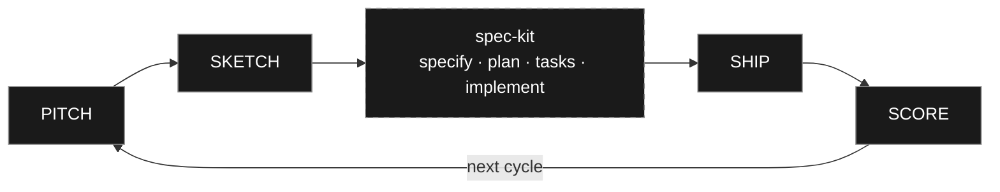

# VIBESLOP — PRODUCT-THINKING LAYERS

> *PITCH — SKETCH — SHIP — SCORE — LOOP.*

Product-thinking layers around [GitHub's spec-kit](https://github.com/github/spec-kit). Spec-kit is the engineering substrate. Vibeslop is what surrounds it — bet validation upstream, launch ceremony and outcome scoring downstream. No replacement. No competition. Just the loops spec-kit doesn't run.

Four skills. Vendor-neutral [Agent Skills](https://agentskills.io). The cycle never closes. It only loops back.

[See the methodology — or13.io/vibeslop](https://or13.io/vibeslop)

---

## THE CYCLE



| Skill | Phase | What it asks |
| --- | --- | --- |
| `vibeslop.pitch` | PITCH | Is this worth building? |
| `vibeslop.sketch` | SKETCH | What's the smallest version that earns the bet? |
| `vibeslop.ship` | SHIP | How do we get it into customers' hands safely? |
| `vibeslop.score` | SCORE | Did the bet pay off? |

---

## INSTALL

```bash
curl -fsSL https://raw.githubusercontent.com/or13/vibeslop/main/install.sh | bash
```

One-liner. No dependencies. Composes with spec-kit.

Update:

```bash
curl -fsSL https://raw.githubusercontent.com/or13/vibeslop/main/install.sh | bash -s -- --force
```

---

## HARNESS COMPATIBILITY

Vibeslop ships skills in the open [agentskills.io](https://agentskills.io) format — `.agents/skills/<name>/SKILL.md` per skill — alongside the [agents.md](https://agents.md) project convention.

| Harness | How it picks up the skills |
| --- | --- |
| Gemini CLI | Auto-discovers `.agents/skills/`. |
| Claude Code | Reads `.claude/skills/`. The installer creates a `.claude/skills` → `.agents/skills` symlink. |
| Any agents.md-compliant agent | Reads `.agents/skills/` directly. |

The installer writes to `.agents/skills/` by default. Earlier versions of vibeslop installed Claude-Code-only files into `.claude/commands/`; re-run the installer to migrate.

---

## HOW IT FEELS

You invoke a skill. The agent does the homework first — prior artifacts, git state, related code, available MCPs. Then it drafts a proposal for the first round and names what's weak about its own draft.

```
vibeslop.pitch — Round 1: The bet (mode: solo)

PRESS RELEASE
"Squinting at bright screens at night? Switch to dark mode in
one tap from any screen."

CUSTOMER FAQ (3 of 5)
— Will it remember my preference? Yes, per-device.
— Does it work on the marketing site? No — that's deferred.
— What about images and videos? Auto-dimmed. Flag if wrong.

COST OF INACTION
Support tickets show ~12/week mention eye strain. Six months
→ ~300 tickets, plus the SEO hit from competitors shipping
first.

MY OWN SOFT SPOTS
— The 12/week number is a sample, not the full ticket data.
  Pull from HubSpot? (~3 min)
— "Auto-dimmed images" is a guess at scope. Cagan's feasibility
  risk is where I'm thinnest.

Push on any of those. Approve as-is. Or pass.
```

Approve, refine, pass. Soft spots you pass on land in the artifact under "Open soft spots" — visible to the next phase, not silenced. The artifact is written when all rounds are done.

---

## PRINCIPLES

The skills share six assumptions. Knowing them upfront tells you what to expect — and what *not* to expect.

**01 — GRADIENT, NOT GATE.** The skill produces an artifact at whatever level of engagement you bring. Engagement makes it sharper. The skill never refuses to write because the thinking is thin. Unresolved items ship in the artifact under "Open soft spots" — visible, not hidden.

**02 — FRAMEWORKS NAMED, NOT PARAPHRASED.** When a framework would sharpen the current draft — Cagan's four risks, B=MAT, the Hook Model, Shape Up appetites, Secure Coding from the threat model, others (the library grows) — the skill calls it out by name. Engaging is rewarded inline. Passing is recorded as a soft spot. Never forced.

**03 — HOMEWORK FIRST.** Each skill front-loads research — prior artifacts, git state, related code, available MCPs — before asking you anything. You land on a grounded proposal, not an empty prompt.

**04 — SELF-CRITICISM INLINE.** Proposals name their own weak spots. *"I drafted X, but I'm guessing about Y — want to push on it?"* You react to specific soft spots, not generic open questions.

**05 — SOLO AND TEAM BOTH WORK.** Each skill detects mode (`CODEOWNERS`, committer diversity in `git log`) and adapts. In solo mode, the agent fills the missing engineering roles — writes code, runs commands, builds the critical path. In team mode, the agent produces planning artifacts the team executes.

**06 — ITERATION COMPOUNDS, THEN GETS COMMITTED.** Re-running a phase updates the artifact in place. Git tracks the evolution. Your second run is smarter than your first because the prior commit is one `git log` away. Uncommitted changes get overwritten on the next run — each skill nudges you once. No nagging.

---

## THE TOOLBOX

The skills aren't a methodology with a fixed framework count. They're a peer thinking partner that draws on a growing library — Working Backwards, Cagan's four risks, JTBD, B=MAT, Fogg's six simplicity factors, the Hook Model, Shape Up appetites, Secure Coding, **Design Thinking** (Empathize / Define / Ideate / Prototype / Test), the **Double Diamond** (the diverge-converge frame around the wheel), **Lean UX hypothesis statements**, the **Design Sprint**, **Wizard of Oz** + **RITE**, Patton's **Story map**, Shostack's **Service blueprint**, Google's **HEART** framework, the **System Usability Scale (SUS)**, **Five Whys**, **Cooper's persona-driven design** with Microsoft's **persona spectrum**, more — and reaches for whichever sharpens the current draft.

Persona-driven design threads through the entire cycle — pitch synthesizes the personas, sketch / ship / score argue from them by name. See [`docs/persona-driven-design.md`](docs/persona-driven-design.md) for the full pattern: how to make a good persona, how to interact with one while designing, common failure modes.

The toolbox grows over time. PRs adding frameworks (with citations) welcome.

---

## SELF-DEPLOYING

`vibeslop.ship` doesn't just write an artifact — it commits and pushes your code, with your approval. `vibeslop.score` reads the deployed state to verify what shipped matches what's live. The skills practice what they preach.

---

## PLAYS WITH SPEC-KIT

Vibeslop composes with [GitHub's spec-kit](https://github.com/github/spec-kit). Spec-kit handles the engineering substrate — constitution, spec, plan, tasks, implement. Vibeslop handles the product-thinking layers spec-kit doesn't have.

— **UPSTREAM.** `vibeslop.pitch` decides if a feature is worth a spec at all. `vibeslop.sketch` adds behavioral discipline (B=MAT, Fogg's simplicity factors, prototype-as-discovery) before `/speckit.specify` runs.

— **DOWNSTREAM.** `vibeslop.ship` handles launch ceremony — struggling-moment messaging, day-one Hook cycle, canary rollout, rollback tripwires. `vibeslop.score` does post-launch outcome analysis and produces the evidence-ranked bet list for the next cycle.

— **STANDALONE.** Vibeslop works without spec-kit. Skills detect `.specify/` and adapt — falling back to `.vibeslop/<feature>/` artifacts when spec-kit isn't installed.

The full flow:

```
vibeslop.pitch  →  vibeslop.sketch  →  /speckit.specify  →  /speckit.plan
                                       /speckit.tasks    →  /speckit.implement
                                                          →  vibeslop.ship
                                                          →  vibeslop.score
                                                          →  (next vibeslop.pitch)
```

---

## REQUIREMENTS

— An AI coding agent that supports the [Agent Skills](https://agentskills.io) standard. Claude Code, Gemini CLI, any [agents.md](https://agents.md)-compliant tool.
— `curl`, for installation.

---

## CONTRIBUTING

PRs welcome. See [CONTRIBUTING.md](CONTRIBUTING.md).

---

## LICENSE

Apache 2.0. See [LICENSE](LICENSE).

---

<p align="center"></p>

<p align="center"><em>Landfill — where consumption ends. The machine pushes forward through what we discarded.</em></p>

<p align="center"><a href="https://or13.io/vibeslop"><strong>or13.io/vibeslop</strong></a></p>
