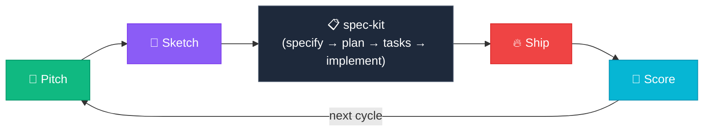

# ⚡ Vibeslop

> *"Pitch the bet, sketch the experience, ship it safely, score the outcome."*

Product-thinking layers around [GitHub's spec-kit](https://github.com/github/spec-kit). Spec-kit handles the engineering substrate (constitution, spec, plan, tasks, implement); vibeslop handles the product-thinking layers spec-kit doesn't have — bet validation upstream, launch and score downstream. Packaged as vendor-neutral [Agent Skills](https://agentskills.io). Four skills. Continuous improvement. 🔄

### 🌐 [See the interactive methodology → or13.io/vibeslop](https://or13.io/vibeslop)

## 🔄 The Cycle



| Skill | Phase | *The Vibe* |
|-------|-------|-----------|
| `vibeslop.pitch` | 🎯 Pitch | *"Is this worth building?"* |
| `vibeslop.sketch` | 💎 Sketch | *"Smallest version that earns the bet"* |
| `vibeslop.ship` | 🔥 Ship | *"Get it into customers' hands safely"* |
| `vibeslop.score` | 🌊 Score | *"Did the bet pay off?"* |

## 🚀 Install

```bash
curl -fsSL https://raw.githubusercontent.com/or13/vibeslop/main/install.sh | bash
```

> 📦 **One-liner** · 🚫 **No dependencies** · 🔌 **Composes with spec-kit**

Update to the latest:

```bash
curl -fsSL https://raw.githubusercontent.com/or13/vibeslop/main/install.sh | bash -s -- --force
```

## 🤝 Harness compatibility

Vibeslop ships skills in the open [agentskills.io](https://agentskills.io) format — `.agents/skills/<name>/SKILL.md` per skill — alongside the [agents.md](https://agents.md) project convention.

| Harness | How it picks up the skills |
|---|---|
| Gemini CLI | Auto-discovers `.agents/skills/` |
| Claude Code | Reads `.claude/skills/` — installer creates a `.claude/skills` → `.agents/skills` symlink for you |
| Any agents.md-compliant agent | Reads `.agents/skills/` directly |

The installer writes to `.agents/skills/` by default, so any harness following the standard sees the same four skills. Earlier versions of vibeslop installed Claude-Code-only files into `.claude/commands/`; re-run the installer to migrate.

## ✨ How It Feels

You invoke a skill. The agent researches your codebase, drafts a proposal for the first round, and **names what's weak about its own draft**:

```
🎯 vibeslop.pitch — Round 1: The bet (mode: solo)

📰 Press release: "Squinting at bright screens at night? Switch to dark
   mode in one tap from any screen."

❓ Customer FAQ (3 of 5):
   Q: Will it remember my preference? A: Yes, per-device.
   Q: Does it work on the marketing site? A: No — that's deferred.
   Q: What about images and videos? A: Auto-dimmed; flag if wrong.

💸 Cost of inaction: support tickets show ~12/week mention eye strain.
   Six months → ~300 tickets, plus the SEO hit from competitors shipping
   first.

⚠️ My own soft spots:
   - The 12/week number is a sample, not the full ticket data — pull
     from HubSpot? (~3 min)
   - "Auto-dimmed images" is a guess at scope. Cagan's feasibility risk
     is where I'm thinnest.

Want to push on any of those, approve as-is, or pass?
```

You approve, refine, or pass. Soft spots you pass on land in the artifact under "Open soft spots" — visible to the next phase, not silenced. The artifact is written when all rounds are done. 🌐 **[See the interactive methodology →](https://or13.io/vibeslop)**

## 📐 Principles

The skills share six assumptions. Knowing them upfront tells you what to expect — and what *not* to expect.

1. **Gradient, not gate.** The skill produces an artifact at whatever level of engagement you bring. Engagement makes it sharper; the skill never refuses to write because the thinking is thin. Unresolved items ship in the artifact under "Open soft spots" — visible, not hidden.

2. **Frameworks named, not paraphrased.** When a framework would sharpen the current draft — Cagan's four risks, B=MAT, the Hook Model, Shape Up appetites, Secure Coding from the threat model, and others (the library grows) — the skill calls it out by name. Engaging with a framework is rewarded inline; passing on one is recorded as a soft spot. Never forced.

3. **Skill does its homework first.** Each skill front-loads research — prior artifacts, git state, related code, available MCPs / CLIs — before asking you anything. You land on a grounded proposal, not an empty prompt.

4. **Self-criticism inline.** Proposals name their own weak spots: *"I drafted X, but I'm guessing about Y — want to push on it?"* You react to specific soft spots, not generic open questions.

5. **Solo and team both work.** Each skill detects mode (`CODEOWNERS`, committer diversity in `git log`) and adapts. In solo mode, the agent fills the missing engineering roles — actually writes code, runs commands, builds the critical path. In team mode, the agent produces planning artifacts the team executes.

6. **Iteration compounds, then gets committed.** Re-running a phase updates the artifact in place; git tracks the evolution. Your second run is smarter than your first because the prior commit is one `git log` away. Uncommitted changes get overwritten on the next run — each skill nudges you once, no nagging.

## 📚 The toolbox

The skills aren't a methodology with a fixed framework count. They're a peer thinking partner that draws on a growing library — Working Backwards, Cagan's four risks, JTBD, B=MAT, Fogg's six simplicity factors, the Hook Model, Shape Up appetites, Secure Coding, and more — and reaches for whichever sharpens the current draft. The toolbox grows over time. PRs adding frameworks (with citations) welcome.

## 🚀 Self-Deploying

**Ship** doesn't just write an artifact — it commits and pushes your code (with your approval). **Score** reads the deployed state to verify what shipped matches what's live. The skills practice what they preach.

## 🔌 Plays with spec-kit

Vibeslop is designed to compose with [GitHub's spec-kit](https://github.com/github/spec-kit). Spec-kit handles the engineering substrate (constitution, spec, plan, tasks, implement); vibeslop handles the product-thinking layers spec-kit doesn't have:

- **Upstream**: `vibeslop.pitch` decides if a feature is worth a spec at all. `vibeslop.sketch` adds behavioral discipline (B=MAT, Fogg's simplicity factors, prototype-as-discovery) before `/speckit.specify` runs.
- **Downstream**: `vibeslop.ship` handles launch ceremony (struggling-moment messaging, day-one Hook cycle, canary rollout, rollback tripwires). `vibeslop.score` does post-launch outcome analysis and produces the evidence-ranked bet list for the next cycle.
- **Standalone**: vibeslop works without spec-kit too. Skills detect `.specify/` and adapt — falling back to `.vibeslop/<feature>/` artifacts when spec-kit isn't installed.

The full flow:

```
vibeslop.pitch  →  vibeslop.sketch  →  /speckit.specify  →  /speckit.plan
                                       /speckit.tasks    →  /speckit.implement
                                                          →  vibeslop.ship
                                                          →  vibeslop.score
                                                          →  (next vibeslop.pitch)
```

## 📋 Requirements

- An AI coding agent that supports the [Agent Skills](https://agentskills.io) standard (e.g., Claude Code, Gemini CLI, or any [agents.md](https://agents.md)-compliant tool)
- `curl` (for installation)

## 🤝 Contributing

PRs welcome. See [CONTRIBUTING.md](CONTRIBUTING.md).

## 📄 License

Apache 2.0 — see [LICENSE](LICENSE).

---

<p align="center">
  🌐 <a href="https://or13.io/vibeslop"><strong>or13.io/vibeslop</strong></a> · Built with vibeslop ⚡
</p>
